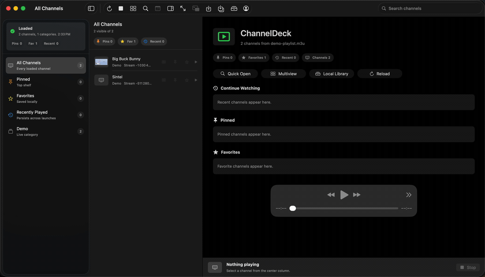

# ChannelDeck

A native IPTV player for accounts that use Xtream-style server login.

The app loads live categories and channels from `player_api.php`, then plays the selected stream with the macOS AVKit player. It also includes copy/open fallbacks for stream URLs, since some IPTV streams may use codecs that AVPlayer cannot decode.

ChannelDeck does not include IPTV subscriptions, provider credentials, or private provider playlists. Use it only with accounts and streams you are authorized to access.

Website: https://thromel.github.io/channeldeck/



## Current Status

- macOS app is available now.
- iOS and iPadOS app source is available now as an early device-build target.
- A real macOS demo recording is available on the website and in this README.
- A built-in sample playlist with public test streams lets new users try the interface without entering provider credentials.

## Features

- Xtream-style account login with server URL, ID, and password.
- Account validation through `player_api.php`.
- Live category loading and live channel loading.
- Home dashboard with pinned, favorite, and recent channel shelves.
- Channel search and category filtering.
- Channel browser source filters and sort modes.
- Command-K quick switcher for fast channel lookup, playback, multiview, pinning, and favorites.
- Persistent pinned channels with a dedicated Pinned category.
- Recently played category that persists across launches.
- Persistent favorites with a dedicated Favorites category.
- Short EPG guide loading for the playing channel, with Now/Next display and a richer guide panel when provider data is available.
- Native AVKit playback.
- Full-screen theater mode.
- Picture-in-picture for the primary live player.
- 2-4 channel multiview playback with independent volume and mute per tile.
- Saved multiview layouts.
- Local-only stream recording to `~/Movies/ChannelDeck` for authorized streams.
- Local library with search, type filters, sorting, and file actions for recordings and saved playlists.
- Playback diagnostics with credential-safe copyable status reports.
- Searchable in-app keyboard shortcut guide.
- Collapsible channel browser.
- Optional account inspector panel.
- HLS `.m3u8` and MPEG-TS `.ts` stream URL modes.
- Local M3U playlist import for authorized direct-stream playlists.
- Built-in sample playlist using public test streams for credential-free UI trials.
- Local M3U playlist export, defaulting to the ChannelDeck local library.
- Copy stream URL fallback.
- Open stream URL fallback for external players or browser handoff.
- Password storage in the macOS Keychain.
- Early iOS/iPadOS app target with Home, Browse, Player, Multiview, Settings, Xtream login, Keychain password storage, and sample playback.
- iOS/iPadOS Home dashboard with pinned, favorite, recent, and channel-count shelves.
- iOS/iPadOS pinned channels, favorites, and recently played filters that persist locally.
- iOS/iPadOS current-channel guide panel with Now/Next provider EPG when available.
- iOS/iPadOS local stream recording for the current channel.
- iOS/iPadOS local library for recordings and saved media, with search, filters, sharing, and delete actions.
- iOS/iPadOS 2-4 channel multiview playback with independent volume and mute per tile.
- Adaptive iPadOS sidebar layout with channel/player/multiview/settings navigation and live status badges.
- iOS/iPadOS local M3U playlist import and export through the Files picker.
- Generic public builds with no provider server, username, password, or private provider playlist bundled.

## Run

### macOS

```bash
./script/build_and_run.sh
```

For a build plus launch check:

```bash
./script/build_and_run.sh --verify
```

The Codex desktop Run action is wired to the same script through `.codex/environments/environment.toml`.

### iOS and iPadOS

The early mobile app lives in `Sources/ChannelDeckIOS` and is wrapped by `ChannelDeckIOS.xcodeproj`.

To run on a physical iPhone or iPad:

1. Open `ChannelDeckIOS.xcodeproj` in Xcode.
2. Select the `ChannelDeckIOS` scheme.
3. Select your connected, unlocked, trusted iPhone or iPad.
4. In Signing & Capabilities, choose your Apple development team for bundle id `io.github.thromel.channeldeck`.
5. Press Run.

For command-line device builds, use the same project and scheme after Xcode can see the device and signing is configured:

```bash
xcodebuild -project ChannelDeckIOS.xcodeproj -scheme ChannelDeckIOS -destination 'platform=iOS,name=Your iPhone Name' build
```

If Xcode reports the device as unavailable, unlock the device, trust the Mac, enable Developer Mode, install any requested iOS platform component from Xcode Settings, and add an Apple ID in Xcode Settings so Xcode can create an Apple Development signing certificate.

The mobile target currently supports a Home dashboard, persisted pins/favorites/recents, live channel browsing, single-channel AVKit playback, current-channel guide data, local recording, a local library, 2-4 channel multiview, account loading, sample playback, local M3U import/export, Keychain password storage, and an adaptive iPadOS sidebar.

## Release Build

```bash
./script/package_release.sh
```

This creates `outputs/ChannelDeck-macOS.zip`. The current package is ad-hoc signed for bundle integrity but not Apple Developer ID signed or notarized.

For the current public zip, unzip `ChannelDeck-macOS.zip`, then right-click `ChannelDeck.app` and choose Open the first time. A future Developer ID build should replace this with a notarized package.

## Notes

- Passwords are stored in the macOS Keychain.
- iOS passwords are stored in the iOS Keychain.
- Some IPTV provider servers use HTTP, so the local app bundle allows HTTP network/media loads.
- The app currently focuses on live TV. VOD/series support can be added through the same API.
- Local recordings and M3U exports are for streams you are authorized to access. M3U files contain playable stream URLs.
- Public builds do not ship provider server URLs, usernames, passwords, or private provider playlists.
- The sample playlist uses public test streams only and is intended for trying the UI, not as IPTV content.

## Planned Features

- iOS and iPadOS feature parity for advanced recording controls and macOS-level playback utilities.
- Shared core package for common Xtream models, playlist parsing, and playback helpers across macOS, iOS, and iPadOS.
- Longer walkthrough recordings for setup, recording, and multiview playback.
- Developer ID signing and notarization for smoother macOS installs.
- Full EPG grid and richer schedule browsing.
- More library management controls for recording metadata and history.
- VOD and series support for compatible provider APIs.

## Keyboard Shortcuts

| Shortcut | Action |
| --- | --- |
| `Command-R` | Reload channels |
| `Space` | Play or pause the current stream |
| `Command-[` | Previous channel |
| `Command-]` | Next channel |
| `Command-K` | Quick open channel switcher |
| `Command-O` | Import local M3U playlist |
| `Command-Shift-O` | Load the built-in sample playlist |
| `Command-D` | Add or remove the current channel from favorites |
| `Command-Shift-D` | Pin or unpin the current channel |
| `Option-Command-M` | Show multiview |
| `Option-Command-G` | Show current channel guide |
| `Option-Command-P` | Start or stop picture-in-picture |
| `Command-Shift-R` | Start or stop recording the current stream |
| `Option-Command-S` | Save local M3U playlist |
| `Option-Command-J` | Show local recordings and saved playlists |
| `Option-Command-C` | Copy playback diagnostics |
| `Command-/` | Show keyboard shortcuts |
| `Command-.` | Stop playback |
| `Control-Command-F` | Enter or exit full-screen player |
| `Escape` | Exit full-screen player |
| `Option-Command-L` | Collapse or show channels |
| `Option-Command-I` | Show or hide account settings |
